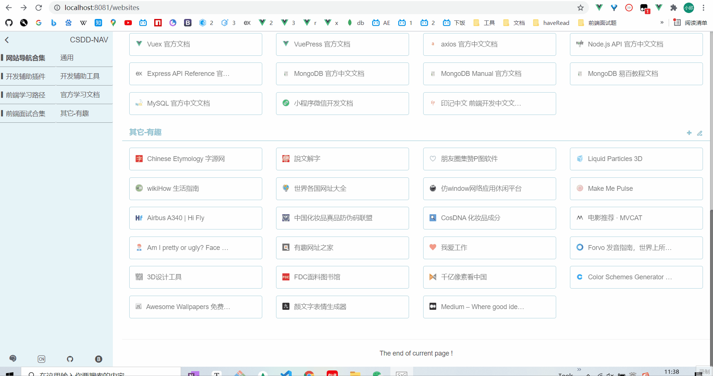
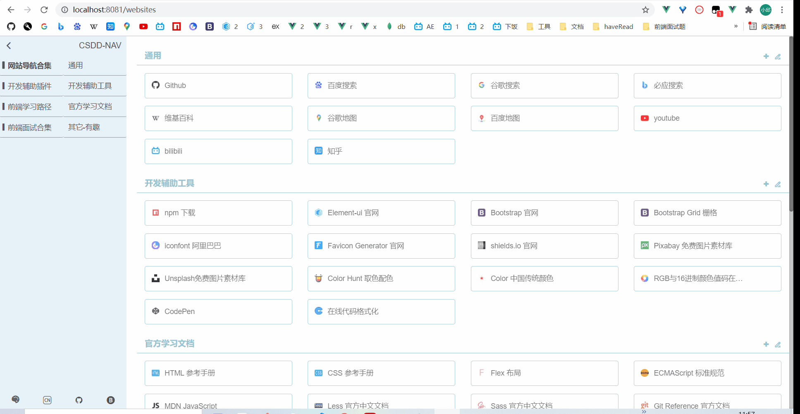
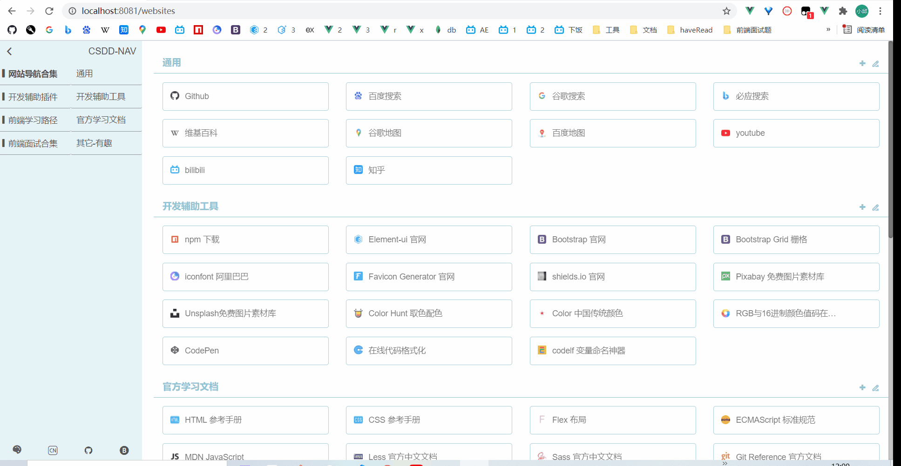
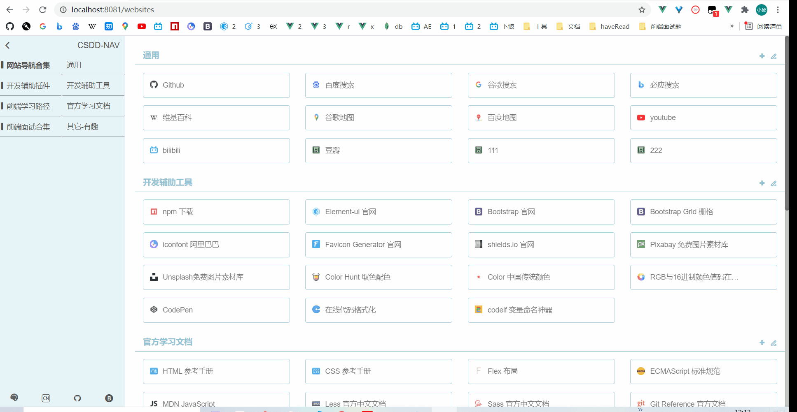

# csdd-nav

**A collection of common and useful websites for Front-end Engineer 前端工程师常用网站集合**

## 写在最前

作为一名合格的前端工程师，除了自身的代码水平要过硬，如何通过开源工具来提高效率也是一个相当重要的技能，随着不断的工作和学习，收藏的网址、工具也越来越多，浏览器的收藏夹也快爆满以及不好检索了，这就有了这个项目最初的雏形，做一个前端工作、学习时常用的网站导航合集，具体功能请看下面

## 快速启动

```
# csdd-nav 根路径
npm i 
npm run server
# server 文件夹 （记得先启用mongodb）
nodemon index.js
```

## 前端技术栈

- vue3
- vue-router
- vuex
- axios
- element-plus
- bootstrap
- sass

## 后端技术栈

- node
- express
- mongodb

## 目录结构说明

```
.
├─ package.json                    配置、依赖管理
├─ server
│    ├─ api.js                     服务器请求接口封装
│    ├─ db.js                      mongodb数据库封装
│    ├─ index.js                   服务器入口文件
│    ├─ tmp_uploads                上传图片临时存储文件夹
│    ├─ menus.csv                  （可导入mongodb使用）
│    └─ websites_cns.csv           （可导入mongodb使用）
├─ src
│    ├─ App.vue
│    ├─ assets
│    │    ├─ allCss                views、components文件夹下的各个vue单文件对应的less样式
│    │    │    ├─ Add.less
│    │    │    ├─ App.less
│    │    │    ├─ Home.less
│    │    │    ├─ More.less
│    │    │    ├─ Theme.less
│    │    │    └─ Websites.less
│    │    ├─ favicon
│    │    │    └─ ...              上传图片成功且提交后，文件会保存在该文件夹
│    │    └─ iconfont
│    │           └─ ...
│    ├─ components                 子组件文件夹
│    │    ├─ Add.vue
│    │    ├─ More.vue
│    │    └─ Theme.vue
│    ├─ main.js
│    ├─ router
│    │    └─ index.js
│    ├─ store
│    │    └─ index.js
│    └─ views                      页面文件夹
│           ├─ Githubs.vue
│           ├─ Home.vue
│           ├─ Studies.vue
│           ├─ Test.vue
│           ├─ Tests.vue
│           └─ Websites.vue
└─ vue.config.js                   跨域、打包等配置
```

## 功能演示

- #### 页面展示、更换主题



- #### 新增



- #### 修改



- #### 删除



## 后续功能

目前只开发了”网站导航合集“这个页面，后续会继续开发”前端学习路径“、”前端面试合集“（因为暂时没有灵感，搁置了~），下面是后续会跟进的功能：

- [ ] 开发“前端学习路径”页面
- [ ] 开发“前端面试合集”页面
- [ ] 买个服务器、部署上线